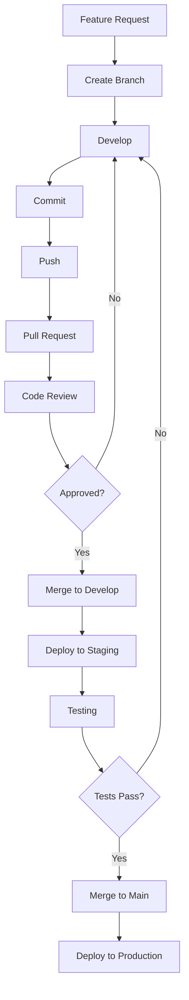

# 🏥 Se7ety Organization

### 💊 Building the Future of Healthcare Technology

---

## 🌟 About Us

**Se7ety** is a cutting-edge healthcare technology organization dedicated to revolutionizing the medical industry through innovative software solutions. We combine modern development practices with healthcare expertise to create impactful applications that improve patient care and streamline medical workflows.

### 🎯 Our Mission

*"Empowering healthcare through technology, one line of code at a time"*

## 🚀 What We Build

<table>
<tr>
<td width="50%">

### 📱 Mobile Applications
Building cross-platform healthcare apps with **Flutter** that provide seamless patient experiences and efficient medical workflows.

</td>
<td width="50%">

### 🌐 Web Platforms
Creating responsive, modern web applications using **React** for healthcare management and patient portals.

</td>
</tr>
<tr>
<td width="50%">

### ⚙️ Backend Systems
Developing robust, scalable APIs with **.NET** to power our healthcare solutions with enterprise-grade reliability.

</td>
<td width="50%">

### 🗄️ Data Management
Leveraging **PostgreSQL** for secure, HIPAA-compliant data storage and advanced healthcare analytics.

</td>
</tr>
</table>

## 🛠️ Technical Arsenal

<table>
  <tr>
    <td align="center" width="33%">
      <h3>📱 Mobile Development</h3>
      
    </td>
    <td align="center" width="33%">
      <h3>🌐 Web Development</h3>
      
    </td>
    <td align="center" width="33%">
      <h3>⚙️ Backend Development</h3>
      
    </td>
  </tr>
  <tr>
    <td align="center">
      <h3>🗄️ Database</h3>
      
    </td>
    <td align="center">
      <h3>🔧 DevOps & Tools</h3>
      
    </td>
    <td align="center">
      <h3>☁️ Cloud & Services</h3>
      
    </td>
  </tr>
  <tr>
    <td align="center" colspan="3">
      <h3>🤖 AI & Data Science</h3>
      
    </td>
  </tr>
</table>

## 👥 Our Team

We're proud to have a talented team of developers, designers, and healthcare professionals working together to build amazing solutions.

<!-- Contributors will be automatically displayed here when you add them to your repositories -->
### 📊 Team Statistics

<table align="center">
<tr>
<td align="center">

</td>
<td align="center">

</td>
<td align="center">

</td>
</tr>
</table>

### 👨‍💻 Team Members

<table align="center">
<tr>
<td align="center" width="150" colspan="4">
<a href="https://github.com/Hedra-Nabil">
 
<b>Hedra Nabil</b>
</a> 
👑 Project Manager 
</td>
</tr>
<tr>
<td align="center" width="150">
<a href="https://github.com/Tahamohamed11">
 
<b>Taha Mohamed</b>
</a> 
💻 Developer & Database Team Leader
</td>
<td align="center" width="150">
<a href="https://github.com/24-mohamedyehia">
 
<b>Mohamed Yehia</b>
</a> 
🤖 AI/DS Leader
</td>
<td align="center" width="150">
<a href="https://github.com/AbdAlAleem-Hassan">
 
<b>Abdalaleem Elsayed</b>
</a> 
⚙️ Backend Team Leader
</td>
<td align="center" width="150">
<a href="https://github.com/yousef-Masoud">
 
<b>Yousef Masoud</b>
</a> 
💻 Developer
</td>
</tr>
<tr>
<td align="center" width="150">
<a href="https://github.com/AhmedElgendy2004">
 
<b>Ahmed Elgendy</b>
</a> 
💻 Developer & Mobile Application Team Leader
</td>
<td align="center" width="150">
<a href="https://github.com/ahmedomar11345">
 
<b>Ahmed Omar</b>
</a> 
💻 Developer
</td>
<td align="center" width="150">
<a href="https://github.com/hanymahm0ud">
 
<b>Hany Mahmoud</b>
</a> 
💻 Developer & Security Team Leader
</td>
<td align="center" width="150">
<a href="https://github.com/MaLB3ndeR">
 
<b>Youssef Madkour</b>
</a> 
💻 Security Team Member
</td>
</tr>
<tr>
<td align="center" width="150">
<a href="https://github.com/mansourayman">
 
<b>mansourayman</b>
</a> 
💻 Developer
</td>
<td align="center" width="150">
<a href="https://github.com/mhamdashraf">
 
<b>mhamdashraf</b>
</a> 
💻 Developer
</td>
<td align="center" width="150">
<a href="https://github.com/nagham959">
 
<b>Nagham Elsorady</b>
</a> 
💻 Developer & Web Team Leader
</td>
<td align="center" width="150">
<a href="https://github.com/Nermeenkamal1">
 
<b>Nermeenkamal1</b>
</a> 
💻 Developer
</td>
</tr>
</table>

**💡 Want to join our team?** Check out our [contributing guidelines](https://se7ety.github.io/Guide_repo/) and start contributing!

## 📚 Resources & Documentation

| Resource | Description | Link |
|----------|-------------|------|
| 📖 **Organization Guide** | Complete guide to our workflows and practices | [Visit Guide](https://se7ety.github.io/Guide_repo/) |
| ⚡ **Git Workflow** | Professional Git practices and conventions | [Git Guide](https://se7ety.github.io/Guide_repo/#git-guide) |
| 🎯 **Best Practices** | Coding standards and development guidelines | [View Docs](https://se7ety.github.io/Guide_repo/) |
| 🔧 **Setup Guide** | Quick start for new team members | [Get Started](https://se7ety.github.io/Guide_repo/) |

## 🎓 For New Members

<b>🚀 Quick Start Guide</b>

### Welcome to Se7ety! 👋

Follow these steps to get started:

1. **📖 Read the Organization Guide**
   - Visit our [comprehensive guide](https://se7ety.github.io/Guide_repo/)
   - Understand our mission and values

2. **⚡ Learn Our Git Workflow**
   - Review the [Git Guide](https://se7ety.github.io/Guide_repo/#git-guide)
   - Understand branching strategies and commit conventions

3. **🛠️ Set Up Your Environment**
   - Install required tools (Flutter, .NET SDK, Docker, etc.)
   - Clone relevant repositories
   - Configure your development environment

4. **👥 Meet the Team**
   - Join our communication channels
   - Introduce yourself to the team
   - Get assigned your first task

5. **💻 Start Contributing**
   - Pick up a beginner-friendly issue
   - Follow our coding standards
   - Submit your first pull request

## 🔄 Development Workflow

We follow industry-standard practices to ensure code quality and team collaboration:

### 📋 Our Process

- ✅ **Feature Branches** - Every feature gets its own branch
- ✅ **Code Reviews** - All code must be reviewed before merging
- ✅ **Automated Testing** - CI/CD pipelines ensure quality
- ✅ **Conventional Commits** - Clear, standardized commit messages
- ✅ **Documentation** - Every feature is properly documented

## 🏆 Achievements & Milestones

| Milestone | Status |
|-----------|--------|
| 🎯 Organization Setup | ✅ Complete |
| 📚 Documentation Portal | ✅ Complete |
| 🔧 Development Guidelines | ✅ Complete |
| 🚀 First Production Release | 🔄 In Progress |
| 🌟 100+ Commits | 🎯 Goal |
| 👥 10+ Contributors | ✅ Achieved |

## 💡 Contributing

We welcome contributions from all team members! Here's how you can contribute:

1. **🐛 Report Bugs** - Found a bug? Open an issue
2. **💡 Suggest Features** - Have an idea? We'd love to hear it
3. **📝 Improve Documentation** - Help make our docs better
4. **💻 Submit Code** - Follow our Git workflow and submit PRs
5. **👀 Review Code** - Help review pull requests

### 📜 Contribution Guidelines

- Follow our [Git Workflow Guide](https://se7ety.github.io/Guide_repo/#git-guide)
- Use conventional commit messages
- Write clear, descriptive PR descriptions
- Ensure all tests pass before submitting
- Update documentation as needed

## 📞 Get in Touch

### 🤝 Let's Connect

Have questions? Want to collaborate? Reach out to us!

## 📊 Organization Stats

### 📌 Pinned Repositories

## 🌟 Featured Projects

| Project | Description | Tech Stack | Status |
|---------|-------------|------------|--------|
| 📱 **Patient App** | Mobile app for patient management | Flutter, Dart | 🔄 Active |
| 👨‍⚕️ **Doctor App** | Mobile app for doctors | Flutter, Dart | 🔄 Active |
| 🌐 **Admin Portal** | Web-based admin dashboard | Flutter Web, React | 🔄 Active |
| 💻 **Website** | Official organization website | React | 🔄 Active |
| ⚕️ **Sehety API** | Core Backend API | .NET, C# | 🔄 Active |
| 🤖 **Medical Agent** | AI-powered medical assistant | Python, FastAPI, LLM | 🔄 Active |
| 🎧 **Support Agent** | AI Customer Support Agent | Python, AI | 🔄 Active |
| 🗄️ **Database** | Centralized Data Storage | PostgreSQL | 🔄 Active |

---

### 💖 Built with Love by the Se7ety Team

**⭐ Star our repositories | 🔔 Watch for updates | 🤝 Join our community**

